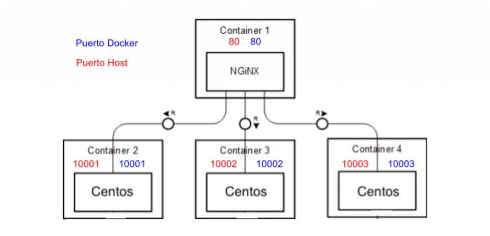
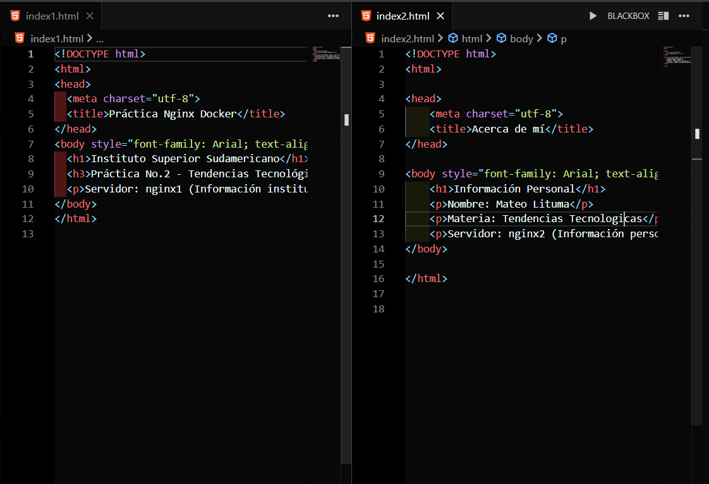
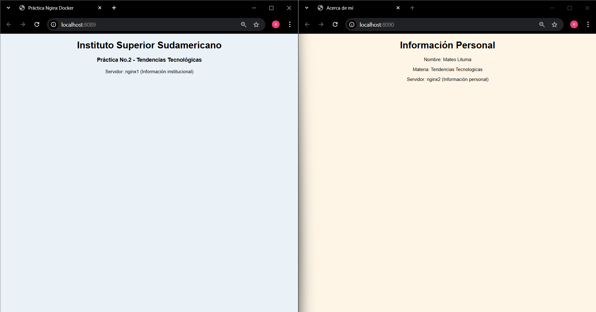
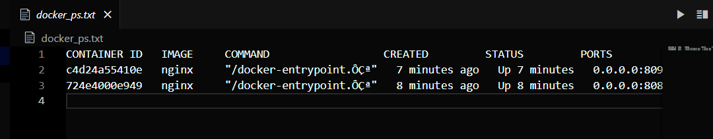

# Práctica: Servidor Web

## 1. Título
Creación y personalización de dos servidores web con Nginx utilizando contenedores Docker.

---

## 2. Tiempo de duración
90 minutos.

---

## 3. Fundamentos

Nginx es un servidor web de alto rendimiento que se utiliza ampliamente para servir sitios estáticos, actuar como proxy inverso o balanceador de carga. A diferencia de otros servidores como Apache, Nginx maneja las conexiones de manera asincrónica, lo que le permite atender a miles de usuarios simultáneamente con un consumo mínimo de recursos.  
Docker, por su parte, es una plataforma de virtualización ligera que permite crear, distribuir y ejecutar aplicaciones dentro de contenedores. Un contenedor es una unidad que encapsula el código, las dependencias y las configuraciones necesarias para ejecutar una aplicación de forma independiente del sistema operativo del host.

En esta práctica se implementan **dos contenedores Nginx independientes**, cada uno con su propio archivo `index.html`. El primer contenedor muestra información institucional y el segundo información personal del estudiante. El propósito es entender cómo se puede crear, modificar y gestionar contenedores, además de copiar archivos entre el host y el contenedor para personalizar la salida del servidor web.

La arquitectura de esta práctica se basa en el uso de imágenes oficiales de Docker Hub, las cuales son descargadas y ejecutadas de manera automática al usar el comando `docker run`. Una vez iniciado el contenedor, Nginx se ejecuta escuchando en el puerto 80 del contenedor, el cual es mapeado a diferentes puertos del host (8089 y 8090) para acceder a cada servidor desde el navegador.

El aprendizaje clave consiste en comprender cómo Docker aísla los entornos de ejecución y cómo se manipulan los archivos internos de los contenedores para adaptarlos a necesidades específicas. También se fortalecen conocimientos de comandos básicos de Linux, manejo de puertos, copiado de archivos y edición de contenido dentro de un entorno de virtualización ligera.  
Además, se refuerza el concepto de **infraestructura como código**, donde los entornos se construyen de manera reproducible y controlada mediante simples comandos.



*Figura 1-1. Diagrama de contenedores con Nginx ejecutándose en dos puertos del host.*

---

## 4. Conocimientos previos

Para realizar esta práctica se necesita tener claros los siguientes temas:

- Comandos básicos de Linux (navegación de archivos, copia, edición).
- Manejo de terminal (PowerShell, Bash o WSL).
- Conceptos básicos de redes: puertos, localhost, dirección IP.
- Uso del navegador web para verificar servicios.
- Conocimiento inicial sobre virtualización y contenedores.
- Instalación y configuración básica de Docker.


*Figura 1-2. Hyper-V activado, WSL y Docker instalado.*

---

## 5. Objetivos a alcanzar

- Implementar contenedores con **Nginx** utilizando la imagen oficial de Docker Hub.  
- Manipular archivos de configuración (`index.html`) dentro de los contenedores.  
- Comprobar la ejecución simultánea de dos servidores web independientes.  
- Desarrollar habilidades en el uso de comandos Docker para gestionar contenedores.

---

## 6. Equipo necesario

- Computador con sistema operativo **Windows 10/11**, **Linux** o **MacOS**.  
- **Docker Desktop** instalado y configurado (v24.0 o superior).  
- Terminal de comandos (PowerShell, Bash, WSL).
- Editor de texto (Nano, VSCode, Notepad++).  
- Navegador web (Chrome, Firefox, Edge).  
- Conexión a internet para descargar la imagen oficial de Nginx.  

---

## 7. Material de apoyo

- Documentación oficial de Docker: [https://docs.docker.com](https://docs.docker.com)  
- Documentación de Nginx: [https://nginx.org/en/docs/](https://nginx.org/en/docs/)  
- Linux Command Cheat Sheet.  
- Video guía de instalación y ejecución de Nginx en Docker.  

---

## 8. Procedimiento

### Paso 1: Creación de contenedores
Se crean dos contenedores basados en la imagen oficial de Nginx, exponiendo los puertos 8089 y 8090.

```bash
docker run -d --name nginx1 -p 8089:80 nginx
docker run -d --name nginx2 -p 8090:80 nginx
docker ps
```


*Figura 1-3. Creación y ejecución de los contenedores Nginx.*

### Paso 2: Copiar archivos desde los contenedores al host
Se copian los archivos index.html originales de cada contenedor al sistema anfitrión para ser modificados.

```bash
docker cp nginx1:/usr/share/nginx/html/index.html ./index1.html
docker cp nginx2:/usr/share/nginx/html/index.html ./index2.html
```


*Figura 1-4. Copia de los archivos index.html al sistema anfitrión.*

### Paso 3: Editar los archivos HTML
Cada archivo se edita con información diferente.

En `index1.html` se coloca información institucional.  
En `index2.html` se coloca información personal del estudiante.

```bash
code ./index1.html
code ./index2.html
```



*Figura 1-5. Archivos index.html personalizados en el host.*

### Paso 4: Copiar los archivos modificados a los contenedores
Una vez editados los archivos, se vuelven a copiar dentro de cada contenedor:

```bash
docker cp index1.html nginx1:/usr/share/nginx/html/index.html
docker cp index2.html nginx2:/usr/share/nginx/html/index.html
```

### Paso 5: Verificar en el navegador
Se abren los siguientes enlaces en el navegador:

- [http://localhost:8089](http://localhost:8089) → Servidor institucional.  
- [http://localhost:8090](http://localhost:8090) → Servidor personal.  



*Figura 1-6. Visualización de los servidores web personalizados en el navegador.*

---

## 9. Resultados esperados

Al finalizar la práctica, se debe tener dos contenedores en ejecución sirviendo contenido distinto.  
El contenedor `nginx1` mostrará información institucional y `nginx2` mostrará información personal.  
Ambos deben ser accesibles desde el navegador mediante los puertos configurados (8089 y 8090).  



*Figura 1-7. Resultados de docker ps mostrando ambos contenedores activos.*

---

## 10. Bibliografía

Docker Inc. (2024). *Docker Documentation*. https://docs.docker.com

Nginx. (2024). *Nginx Documentation*. https://nginx.org/en/docs/

Linux Foundation. (2023). *Linux Command Line Basics*. The Linux Foundation.
